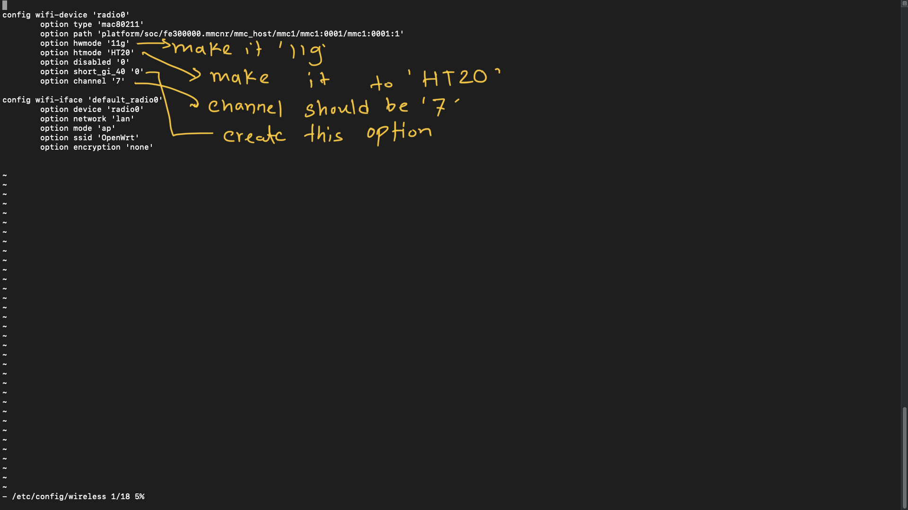

# Secure-Raspberry-Pi-Router


This is a super crazy project that I have done so far. Raspberry Pi can do anything. So I choose to use Raspberry Pi as secure router when I'm using public unsecure internet over VPN. For this I'm going to install openWRT which is a Linux based open source router. I can use this router anywhere, coffeeshop, hotel, airbnb anywhere. It connect to a public wifi as a client and give you a secure internet access. 

## Before Start
1. We need a Raspberry Pi 4. Because it has almost everything I need. It has ethernet, USB and most importantly it has built-in wifi antena. So, here, I'm using Raspberry Pi 4, Model B, RAM 4GB, Single Core Processor
2. Micro SD card, cause Rasberry Pi doesn't have any built-in storage. 
3. A USB wifi adapter. (https://www.amazon.com/gp/product/B01KWQAQ00/ref=ppx_yo_dt_b_search_asin_title?tag=networkchuck-20&ie=UTF8&psc=1&geniuslink=true) even though pi has already built-in wifi, why I need another wifi adapter? Beacause I need two wifi interface. The wifi on the board which is built-in in my raspberry pi 4, it will connect to any public wifi available. Beside, the wifi adapter will be giving me wifi. It will brodcasting my SSID and what I connect to get access to the internet. 
4. A ethernet cable. 


## Pi Image Burner
Raspberry Pi has own image burner which is fast and easy. We are goning to use that from their website. (https://www.raspberrypi.com/software/) 


Then go to openWRT website and Download the installation file that machetes my raspberry pi. *Note: It takes 5 sec.* (https://openwrt.org/toh/raspberry_pi_foundation/raspberry_pi)


It's time to write this image into our Pi. So, First, We need to put my SD card to my PC and open the Pi Imager. Under Operating system click "CHOOSE OS" then select "Use custom". Then select the file you download from openWRT. Now click on "Storage" on pi Imager and select your sd card. Mine was SDHC 8GB and hit "Write" button. It will take less than 50 seconds. After It write is done, it automatically reject the SD card. Then put that sd card to your respbarry pi. 


Now, take your Ethernet wire, one side goes to Raspberry pi, and other side connect with your laptop or computer what ever it is. And connect the power in pi. It will boot up automatically. 

## Pi Setup
So, now we have to access our pi with new openWRT. So as my computer connected with raspbbery pi with ethernet by default my Pi has IP address which is 192.168.1.1. Now our goal is to be able to access this IP address so we can configure that. For that, we have to give our computer our interface and IP address in that subnet. IP address 192.168.1.10. 

For windows user
1.open your control panel and click on view network status and tasks. 

2. In Network 3, Click on Ethernet2. 

Then click on properties > Internet Protocol Version 4 (TCP/IPV4). Then change from Obtain an IP address automatically to use the following IP address: 


For MAC user
1. Open system preferences > Network, the select from the ethernet from the left side and click on drop down menu for "Configure IPV4" and select manually then use the same as shows for windows. 

After that your raspberry pi is ready to access. For this is project I used both Windows and Mac. As it take a lots of time so, i switch between them. 

## Access Pi
Now we have to try to access this pi. we know the IP address and the username is "root". To access this we just need to open command prompt(for windows) or terminal(for mac and linux) then type 
```
ssh root@192.168.1.1
```
the type "yes"
and it will connect with OPENWRT. As there is no password setup, it won’t ask for password. This is insecure. We have to make a password now. type
```
passwd
```
Now input your new password and confirm it. If it successfully changed the password it will shows like that
```
passwd: password for root changed by root
```

Now, it's time to access pi. Type
 ``` 
 cd /etc/config
 ```
 ```
 ls
 ```
 you can see there is some awesome file. Like, dhcp, dropbear, firewall, luci, network, rpcd, system, ucitrack, uhttpd, wireless.
 All this files hold ip configuration of our raspberry pi router. We need to make some change in this file. But before make this file changes, we should and we must make a backup file, incase we mass it up. We will backup only three files which we are going to change. network, wireless, firewall
How to backup file? Follow this command one by one. 
```
cp firewall firewall.bk
cp wireless wireless.bk
cp network network.bk
```
Now check for it accually works or not. Do 
```
ls
```
Owal!!!!!! Now we can actually play with this file, even though we mess it up. 

## configure OpenWRT Network
So, as we go /etc/config now we have to edit some configuration for network, firewall and wireless files. To edit this we need a text editor. In there we are going to use vi text editor software. So type
```
vi network
```
Now we have to change something in here. First we need to change the IP address. In the "config interface 'lan'" go to option ipaddr and change the way you like,(Note: to edit in vim editor, first press "i" in your keyboard, then type whatever you want to) I'm using 10.97.97.1(make sure that is private). then create a new option under the "option ip6assign '60'" ----> "option force_link '1' ".
That means that is ip address is 10.97.97.1 and keep this config and save it whether he is up or not. 

Now we have to create a new inteface
Follow along with 


Now after we done editing we need to exit vim editor, How can you we do?  
So save and exit the vim editor we need to use three things. 
1. Hit "Esc" in your keyboard
2. type ":wq"
3. Hit "Enter"

Now, it time to change our firewall.
```
vi firewall
```
Here, we are going to change "config zone 'wan' > option input REJECT to ACCEPT. (you vi same as before to insert and save and exit)


Now exit the vi editor type
```
reboot
```
Now we are lose connection. Whatever we did before, i mean edit the file now we can actually use that. When it lose connection it will shows the previous ip address. But I change my ip as 10.97.97.1
So all we had to do now change our adapter back to our DHCP. Where in windows go to control panel and click the ethernet 2 same as before > properties > Internet Protocol Version 4 (TCP/IPv4) > obtain an IP address automatically. 


Now type 
```
ipconfig
````
in windows and look the interface under Ethernet adapter Ehernet: 
Here it shows IPv4 Address: 10.97.97.(something)
which is connected with Default Gateway 10.97.97.1

Now it's time for check my private ip is working or not.
```
ssh root@10.97.97.1
```
It should ask for password. And type yes



#### Great, We manage our Raspberry Pi Router Securely.


## Connect OpenWrt to Wifi
Now, we have our new IP address on our raspberry pi, new subnet. Our next task is to get our USB Wifi adapter set up. If we just plug it in to our raspberry pi, nothing will acually happen. Before we plug in this usb wifi adapter, we need to download and install some driver. To download those driver our raspberry pi need internet access. Now our task is to get his internal wifi adapter to connect my home router. To get this access,
in the terminal type

```
vi /etc/config/wireless
```
We have to make one change to our radio0 interface, which is the default built-in on our raspberry pi. We have to make this change in order to make this work. 


Then, save and exit from vi editor. ESC > :wq > Enter. Now we have to apply that configuration to our wireless interface. Follow Those commands
```
uci commit wireless
wifi
```


this should work now. You can go to your wifi search in your phone and you will see OpenWRT, open wifi. 


Now we are going to take that connection and make it connect to your wifi. For that we are going to GUI. Open any web broswer, Here I'll use Google Chrome. And type 10.97.97.1(your customize raspberry pi IP address).
And login there with your root username and password that you created yearlier fo Raspberry Pi. 


After you login, from the tab select Network > Wireless 
You will see radio0 wireless interface which We created.


Then click on the scan button on radio0 interface. And it will find all the network in your near by. Select your home network by clicking "Join Network". So this is the simple process we have to do everytime we join in a new network. 

Here, we have to do two things, one is check the box says, "Replace wireless configuration". Then in "WPA passphrase" input your home network password. Then hit on submit and save.
Then hit "Save & Apply" in the Associate Stations. Now our interface is connected to my network "F31AE2". 
Now we should have internet in our raspberry pi. How can we check it? Use Ping
```
ping google.com
```
Oh yeah. It's working. To stop ping control + C. 
So, now our goal in usb wifi adapter set up. Before we input this wifi adapter, we need to input some command line that will help to recognize this wifi adapter. 
Go back to terminal then type
```
opkg update
```
Now we will install bunch of packages all in ones. And will all of this command line should be drivers for the most of the wifi USB adapters you have. Use this command

```
opkg install kmod-rt2800-lib kmod-rt2800-usb kmod-rt2x00-lib kmod-rt2x00-usb kmod-usb-core kmod-usb-uhci kmod-usb-ohci kmod-usb2 usbutils openvpn-openssl luci-app-openvpn nano
```

Now our usb wifi adapter is ready to plug in. Before you plug in you can use this following command
```
lsusb
```
to see the corrent usb adapter added. Here mine has 3 current working usb. 


After we input our wifi adapter we can run this "lsusb" command again so see if it can recognize it. 


So now bring this "Ralink 802.11 n WLAN" up, make him alive, we need to type one command line. if this command is work for you then mean your driver being accepted. command is
```
ifconfig wlan1 up
```
if there is no issue, your network in up. To check the interface,  type
```
ifconfig
```


Here, wlan0 is connecting us to the public wifi or whatever wifi it supposed to be right now. Here in it wifi in my house. And it supplying me internet. On the other hand, wlan1 is doing nothing. We need to configure him to become a wireless access point for us to connect to and have internet. 

## Wireless network Setup
Now, make our usb wifi adapter functional we need to type in command line:
```
nano /etc/config/wireless
```
and hit enter. 
and edit this with nano editor. We don't have to enter 'i' this time. just use arrow key on your keyboard and edit those file. To do edit
1. In 'config wifi-device 'radio1', make option disabled '0'
2. Now in wifi-iface chnage ssid name to anything you want, I used "MuhfatVPN".
3. Change encryption none to psk2. (you can use any type of encryption)
4. make a new option. option key 'anything you like'


That's it. Now you to save this nano file and exit. Now save in nano editor we use "Control + X then y, then Enter".
And just as before to commit our configuration, we'll do
```
uci commit wireless
```
```
wifi
```
Now, we can actually add to our MufatVPN network and access to internet. Use our phone and connect to this wifi and password should be same as option key 'what ever you used'
#### Boom our wifi is working. Now I have the working router. We can go anywhere, connect to any public network in OpenWRT and wifi works well. However, we are not secure. We are not protected. Our traffic is not encrypted. We are not going secure through VPN. So the next task for us is to config, we are going to set it up to where all of our traffic go over to the NordVPN. This is paid version of VPN. NordVPN is very good, paying for this is totally worth it. As I'm a college student I used my student discount. So before you purchase, look for if there any available discount for you. 


